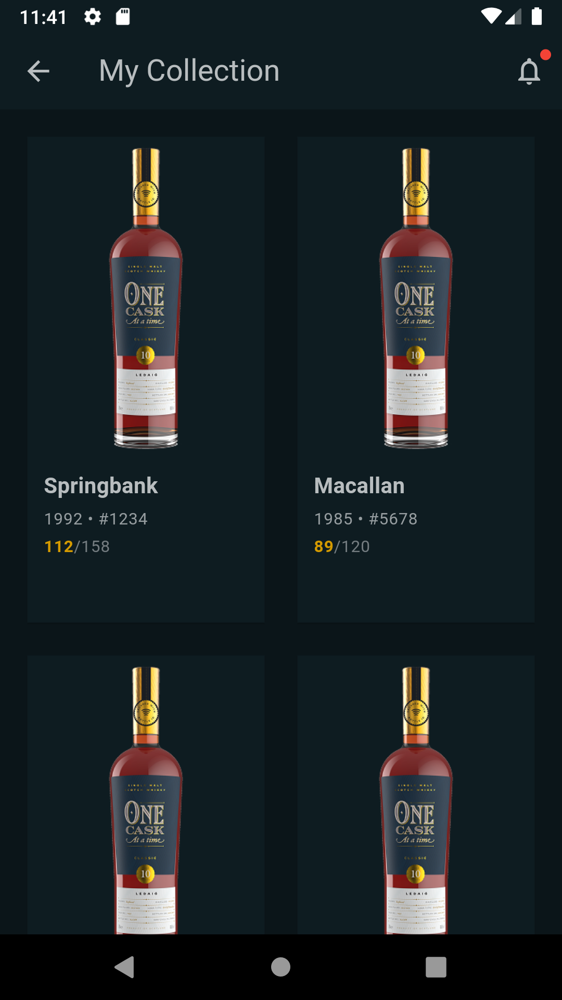
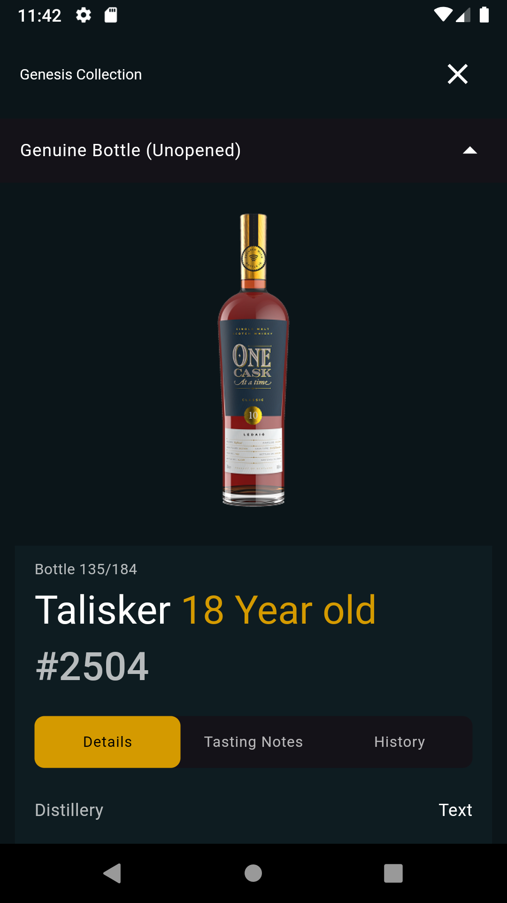
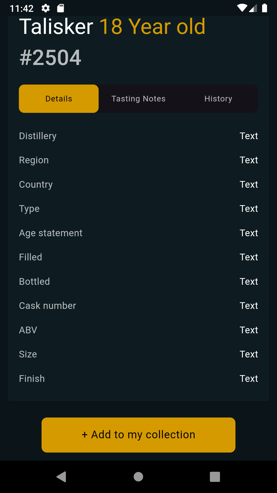
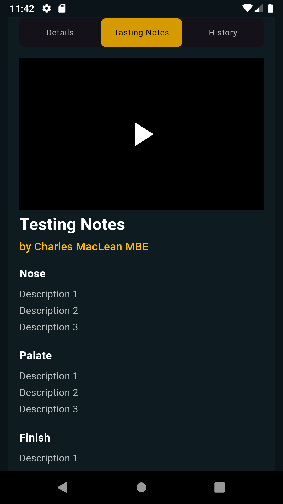
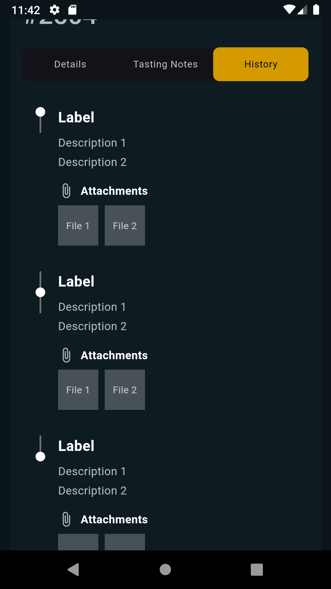

# **one_cask** - A Flutter Application

## **Getting Started**

Welcome to the **one_cask** project, a Flutter-based mobile application. This documentation serves as a guide to help you understand the key dependencies and their role in the development process.

If you’re new to Flutter, here are some useful resources to get you started:

- [Lab: Write your first Flutter app](https://docs.flutter.dev/get-started/codelab)
- [Cookbook: Useful Flutter samples](https://docs.flutter.dev/cookbook)
- For further Flutter development support, refer to the [official Flutter documentation](https://docs.flutter.dev/), which offers tutorials, samples, and full API references.

---

## **Dependencies**

This project leverages several packages to optimize development and enhance the functionality of the app.

### **State Management**
- `flutter_bloc: ^9.0.0`:  
  This package is used to implement **BLoC (Business Logic Component)** architecture in the application. It allows for the separation of business logic from UI code, enabling scalable and maintainable state management. The package helps in managing states in a predictable way and offers a high-level structure for handling complex states.
  
- `equatable: ^2.0.7`:  
  `Equatable` is used in conjunction with `flutter_bloc` to make Dart objects **comparable** by value rather than reference. It simplifies state equality comparisons and ensures that `BLoC` events and states can be compared efficiently.

### **Networking and Connectivity**
- `dio: ^5.8.0+1`:  
  **Dio** is a powerful HTTP client for Dart that simplifies API calls and allows for advanced features such as interceptors, global configurations, and request cancellation. It's ideal for handling network requests, managing responses, and making the network layer more robust and flexible.
  
- `connectivity_plus: ^6.1.3`:  
  This package is used to check the **network connectivity** of the device. It provides easy-to-use methods to detect whether the device is connected to the internet and if the connection is via Wi-Fi or mobile data.

### **Local Storage**
- `hive: ^2.2.3`:  
  **Hive** is a lightweight and fast key-value database. It allows for efficient local data storage in a Flutter app without relying on complex database systems. It's particularly useful for persisting small amounts of structured data, such as user preferences or simple app data.
  
- `hive_flutter: ^1.1.0`:  
  This package provides Flutter-specific functionality to integrate `Hive` with Flutter. It ensures seamless interaction between `Hive` and Flutter’s reactive UI components, offering real-time updates when the database content changes.

### **Dependency Injection**
- `get_it: ^8.0.3`:  
  **GetIt** is a service locator for Dart and Flutter, helping manage dependencies across the application. It allows for decoupling of code, ensuring that objects and services can be accessed globally without the need to explicitly pass them around, making the application more modular.
  
- `injectable: ^2.5.0`:  
  This package is used to simplify the process of **dependency injection** in your Flutter project. It works in tandem with `get_it` and uses annotations to generate the necessary code, reducing boilerplate and ensuring that your dependency graph is efficiently managed.

### **JSON Serialization**
- `json_annotation: ^4.9.0`:  
  `json_annotation` is used in conjunction with `json_serializable` to provide a **code generation** mechanism for JSON serialization and deserialization. It simplifies the process of converting between JSON data and Dart objects, ensuring that the app’s models are easy to work with.

### **UI Utilities**
- `flutter_animate: ^4.5.2`:  
  This package is designed for **animations** in Flutter. It simplifies adding animated effects to your app, such as fading, scaling, and sliding elements, to enhance the user experience. Although optional, it’s highly recommended for improving the app's visual appeal and making it more engaging.

---

## **Dev Dependencies**

These dependencies are specifically for development purposes, including testing, code generation, and more.

### **Code Generation**
- `build_runner: ^2.4.4`:  
  **Build Runner** is a code generation tool that automates the generation of repetitive code. It's essential for packages like `json_serializable`, `hive_generator`, and `injectable_generator` to generate the necessary files based on annotations. It simplifies the development workflow and reduces manual code-writing errors.
  
- `hive_generator: ^2.0.0`:  
  This package is used for generating Hive-specific **type adapters** for serializing and deserializing objects. With code generation, it eliminates the need to manually write adapters, making working with `Hive` more efficient.
  
- `injectable_generator: ^2.1.3`:  
  Works alongside `injectable` to automatically generate the code required for **dependency injection**, reducing boilerplate and making the DI setup seamless.
  
- `json_serializable: ^6.7.1`:  
  This package automatically generates the code required for **JSON serialization** based on your model classes. It integrates with `json_annotation` to provide a streamlined process for converting data between JSON and Dart objects.

### **Testing**
- `mocktail: ^1.0.4`:  
  **Mocktail** is used for creating **mock objects** in unit and widget tests. It helps simulate the behavior of classes and functions that are external to the unit being tested, making it easier to isolate the code under test and write effective tests.
  
- `bloc_test: ^10.0.0`:  
  This package provides utilities for testing **BLoC** logic. It allows you to simulate events and check the resulting states, ensuring that your business logic is working correctly.

---

## **Conclusion**

By using these packages, the **one_cask** Flutter project achieves a highly modular, maintainable, and testable architecture. The chosen dependencies are essential for building a robust app, managing state, handling API requests, local storage, and improving performance through efficient testing and dependency management. With these packages in place, the development workflow is streamlined, and the app is prepared for scalability and future enhancements.

---

### Outcome Images

Below are the outcome images of the **one_cask** Flutter application, showcasing various features and stages of the app's functionality. These images represent the visual progression and key elements implemented within the app, offering a glimpse into the overall user experience.

- 
- 
- 
- 
- 
- 
- 

---

**Happy coding!** 🚀
